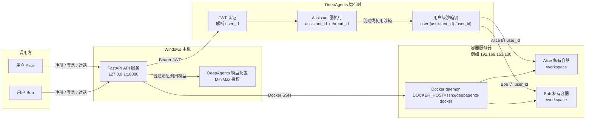

# Docker Sandbox API 服务操作手册

本文面向本地开发和联调环境，说明如何通过 `examples/deploy-docker-user-sandbox` API 服务完成一个完整场景：用户注册、Assistant 创建、Thread 创建、与 Agent 对话，以及 Docker 沙箱执行验证。

如果你希望按教学步骤从空白终端开始执行，请先看配套文档：[Docker Sandbox API 服务从 0 开始教学](docker-sandbox-api-zero-to-one-tutorial.md)。

## 场景总览图



技术思路是把 API 服务作为控制平面：它负责用户注册、登录、Assistant 元数据、Thread 所有权校验和请求路由；把 DeepAgents Docker sandbox 作为数据平面：它根据 `assistant_id + user_id` 创建或复用远程 Docker 容器。普通对话走模型配置，`run:` 消息进入用户私有容器执行。

当前验证环境：

- API 服务运行在 Windows 本机。
- Docker daemon 运行在容器服务器上，示例地址为 `192.168.153.130`，SSH 别名为 `deepagents-docker`。
- API 服务通过 `DOCKER_HOST=ssh://deepagents-docker` 访问远程 Docker daemon。

## 1. 核心概念

### User

`user` 是 API 服务认证后的用户身份。用户通过 `/api/v1/auth/register` 注册，通过 `/api/v1/auth/login` 获取 JWT。服务端会从 JWT 中提取 `user_id`，并把它作为 Docker 沙箱隔离边界的一部分。

### Assistant

`assistant` 是一个逻辑上的 Agent/图配置，不是进程。它定义：

- `id`：Assistant 逻辑 ID。
- `name`：显示名称。
- `model`：对话模型，例如 `anthropic:MiniMax-M2.7-highspeed`。
- `image`：沙箱镜像，例如 `python:3.12-slim`。
- `base_dir`：容器内工作目录，当前默认 `/workspace`。

### Thread

`thread` 是一次多轮对话会话。一个用户可以为同一个 Assistant 创建多个 Thread。

在当前 `scope=user` 语义下，沙箱复用规则是：

```text
cache_key = user:{assistant_id}:{user_id}
```

因此：

- 同一个用户、同一个 Assistant 的多个 Thread 共享同一个 Docker 容器。
- 不同用户即使使用同一个 Assistant，也会使用不同 Docker 容器。
- 不同 Assistant 默认不会共享同一个用户容器。

## 2. 启动前检查

在 `D:\srcs\deepagents` 下执行。

### 2.1 确认远程 Docker 可访问

```powershell
ssh -o BatchMode=yes deepagents-docker "hostname && docker version --format '{{.Server.Version}}'"
```

当前验证过的输出：

```text
aibot
28.4.0
```

### 2.2 确认沙箱镜像可用

```powershell
ssh -o BatchMode=yes deepagents-docker "docker image inspect python:3.12-slim"
```

如果远程主机尚未准备该镜像，可先拉取：

```powershell
ssh -o BatchMode=yes deepagents-docker "docker pull python:3.12-slim"
```

镜像存在或拉取成功后可继续 API 流程。

## 3. 启动 API 服务

使用临时 SQLite 数据库启动，避免污染示例目录里的默认 `sandbox_api.db`。

```powershell
cd D:\srcs\deepagents

$env:PYTHONPATH = "D:\srcs\deepagents\libs\cli;D:\srcs\deepagents\libs\deepagents"
$env:DOCKER_HOST = "ssh://deepagents-docker"
$env:DEEPAGENTS_SANDBOX_API_ENABLE_MODEL = "1"
$env:SANDBOX_API_DB_PATH = "$env:TEMP\deepagents-sandbox-api-demo.db"

cd D:\srcs\deepagents\examples\deploy-docker-user-sandbox
uv run uvicorn server:app --host 127.0.0.1 --port 18080
```

打开或访问：

```text
http://127.0.0.1:18080/openapi.json
```

看到 OpenAPI JSON 即表示服务已启动。

## 4. 场景操作：从注册到对话

以下命令使用 PowerShell。为了避免 PowerShell 的 `curl` 别名差异，命令中统一使用 `curl.exe`。

### 4.1 注册用户 Alice

```powershell
$BaseUrl = "http://127.0.0.1:18080"

$Alice = curl.exe -s -X POST "$BaseUrl/api/v1/auth/register" `
  -H "Content-Type: application/json" `
  -d '{"username":"alice-demo","password":"pass-12345"}' | ConvertFrom-Json

$Alice
```

典型返回：

```json
{
  "id": "usr_xxxxxxxxxxxx",
  "username": "alice-demo",
  "created_at": "2026-05-21T..."
}
```

### 4.2 登录并保存 JWT

```powershell
$AliceLogin = curl.exe -s -X POST "$BaseUrl/api/v1/auth/login" `
  -H "Content-Type: application/json" `
  -d '{"username":"alice-demo","password":"pass-12345"}' | ConvertFrom-Json

$AliceToken = $AliceLogin.access_token
```

之后请求都带：

```text
Authorization: Bearer <AliceToken>
```

### 4.3 创建 Assistant

```powershell
$Assistant = curl.exe -s -X POST "$BaseUrl/api/v1/assistants" `
  -H "Authorization: Bearer $AliceToken" `
  -H "Content-Type: application/json" `
  -d '{
    "id": "minimax-coder-demo",
    "name": "Minimax Coder Demo",
    "model": "anthropic:MiniMax-M2.7-highspeed",
    "image": "python:3.12-slim",
    "base_dir": "/workspace"
  }' | ConvertFrom-Json

$Assistant
```

这里会登记 Assistant 配置。实际 Docker 容器通常在第一次 chat 调用时创建或复用。

### 4.4 创建 Alice 的第一个 Thread

```powershell
$AliceThread1 = curl.exe -s -X POST "$BaseUrl/api/v1/threads" `
  -H "Authorization: Bearer $AliceToken" `
  -H "Content-Type: application/json" `
  -d '{"assistant_id":"minimax-coder-demo","name":"alice-thread-1"}' | ConvertFrom-Json

$AliceThread1
$AliceThreadId1 = $AliceThread1.thread_id
```

### 4.5 发送普通 Agent 对话

```powershell
$Chat1 = curl.exe -s -X POST "$BaseUrl/api/v1/threads/$AliceThreadId1/chat" `
  -H "Authorization: Bearer $AliceToken" `
  -H "Content-Type: application/json" `
  -d '{"message":"Reply with exactly: api-agent-ok"}' | ConvertFrom-Json

$Chat1.response
$Chat1.container_id
```

期望响应中包含：

```text
api-agent-ok
[Sandbox Active] Container <container-id-prefix> verified.
```

这说明：

- Minimax 模型路径已被调用。
- API 服务已经为该用户和 Assistant 创建或复用了 Docker 沙箱。

### 4.6 在 Alice 沙箱中执行命令

以 `run:` 开头的消息会作为 shell 命令在用户私有 Docker 容器中执行。

```powershell
$Run1 = curl.exe -s -X POST "$BaseUrl/api/v1/threads/$AliceThreadId1/chat" `
  -H "Authorization: Bearer $AliceToken" `
  -H "Content-Type: application/json" `
  -d '{"message":"run: python --version && echo alice-secret-data > /workspace/shared.txt && cat /workspace/shared.txt"}' | ConvertFrom-Json

$Run1.response
$AliceContainerId = $Run1.container_id
```

期望响应包含：

```text
Python 3.12
alice-secret-data
```

## 5. 验证用户级沙箱复用

### 5.1 同一用户创建第二个 Thread

```powershell
$AliceThread2 = curl.exe -s -X POST "$BaseUrl/api/v1/threads" `
  -H "Authorization: Bearer $AliceToken" `
  -H "Content-Type: application/json" `
  -d '{"assistant_id":"minimax-coder-demo","name":"alice-thread-2"}' | ConvertFrom-Json

$AliceThreadId2 = $AliceThread2.thread_id
```

### 5.2 第二个 Thread 读取第一个 Thread 写入的文件

```powershell
$Run2 = curl.exe -s -X POST "$BaseUrl/api/v1/threads/$AliceThreadId2/chat" `
  -H "Authorization: Bearer $AliceToken" `
  -H "Content-Type: application/json" `
  -d '{"message":"run: cat /workspace/shared.txt"}' | ConvertFrom-Json

$Run2.response
$Run2.container_id
```

期望：

- 返回 `alice-secret-data`。
- `$Run2.container_id` 等于 `$AliceContainerId`。

这证明同一用户、同一 Assistant 的多个 Thread 复用同一个持久化 Docker 沙箱。

## 6. 验证不同用户隔离

### 6.1 注册 Bob 并登录

```powershell
$Bob = curl.exe -s -X POST "$BaseUrl/api/v1/auth/register" `
  -H "Content-Type: application/json" `
  -d '{"username":"bob-demo","password":"pass-12345"}' | ConvertFrom-Json

$BobLogin = curl.exe -s -X POST "$BaseUrl/api/v1/auth/login" `
  -H "Content-Type: application/json" `
  -d '{"username":"bob-demo","password":"pass-12345"}' | ConvertFrom-Json

$BobToken = $BobLogin.access_token
```

### 6.2 Bob 创建 Thread

```powershell
$BobThread1 = curl.exe -s -X POST "$BaseUrl/api/v1/threads" `
  -H "Authorization: Bearer $BobToken" `
  -H "Content-Type: application/json" `
  -d '{"assistant_id":"minimax-coder-demo","name":"bob-thread-1"}' | ConvertFrom-Json

$BobThreadId1 = $BobThread1.thread_id
```

### 6.3 Bob 尝试读取 Alice 文件

```powershell
$BobRun = curl.exe -s -X POST "$BaseUrl/api/v1/threads/$BobThreadId1/chat" `
  -H "Authorization: Bearer $BobToken" `
  -H "Content-Type: application/json" `
  -d '{"message":"run: cat /workspace/shared.txt"}' | ConvertFrom-Json

$BobRun.response
$BobRun.container_id
```

期望：

```text
cat: /workspace/shared.txt: No such file or directory
```

并且：

```powershell
$BobRun.container_id -ne $AliceContainerId
```

这证明不同用户使用不同容器，Bob 无法读取 Alice 的工作区文件。

## 7. 查看和清理沙箱

### 7.1 从 API 查看沙箱记录

```powershell
curl.exe -s -X GET "$BaseUrl/api/v1/sandboxes" `
  -H "Authorization: Bearer $AliceToken" | ConvertFrom-Json
```

典型记录：

```json
{
  "cache_key": "user:minimax-coder-demo:usr_xxxxxxxxxxxx",
  "container_id": "959ec9af...",
  "status": "running",
  "last_active_at": "2026-05-21T..."
}
```

### 7.2 从远程 Docker 查看容器

```powershell
ssh deepagents-docker "docker ps -a --filter label=deepagents.sandbox=true --format '{{.ID}} {{.Names}} {{.Status}} {{.Labels}}'"
```

容器会带有：

```text
deepagents.sandbox=true
deepagents.cache_key=user:<assistant_id>:<user_id>
```

### 7.3 清理验证容器

只删除本次验证产生的容器 ID，不要粗暴清空其他业务容器。

```powershell
ssh deepagents-docker "docker rm -f <alice_container_id> <bob_container_id>"
```

再次确认：

```powershell
ssh deepagents-docker "docker ps -a --filter label=deepagents.sandbox=true"
```

## 8. 配置手册

### 8.1 API 服务环境变量

本地启动 API 服务前设置：

```powershell
$env:PYTHONPATH = "D:\srcs\deepagents\libs\cli;D:\srcs\deepagents\libs\deepagents"
$env:DOCKER_HOST = "ssh://deepagents-docker"
$env:DEEPAGENTS_SANDBOX_API_ENABLE_MODEL = "1"
$env:SANDBOX_API_DB_PATH = "$env:TEMP\deepagents-sandbox-api-demo.db"
```

变量说明：

| 变量 | 作用 |
| --- | --- |
| `PYTHONPATH` | 让示例服务能加载本地 `libs/cli` 和 `libs/deepagents` 源码 |
| `DOCKER_HOST` | 指向远程 Docker daemon，当前为 `ssh://deepagents-docker` |
| `DEEPAGENTS_SANDBOX_API_ENABLE_MODEL` | `1` 表示普通 chat 调用真实模型；不设置时使用确定性模拟回复 |
| `SANDBOX_API_DB_PATH` | 指定 SQLite 数据库路径，建议验证时使用临时库 |

### 8.2 模型配置

当前 Minimax 模型配置来自用户级 DeepAgents 配置：

```text
C:\Users\29267\.deepagents\config.toml
C:\Users\29267\.deepagents\.env
```

Assistant 示例使用：

```text
anthropic:MiniMax-M2.7-highspeed
```

不要在文档、日志或命令输出中打印 API Key。只需要确认 `.env` 中存在相应授权变量。

### 8.3 容器命名和标签

Docker 容器名称格式：

```text
deepagents-sandbox-<hash>
```

关键标签：

```text
deepagents.sandbox=true
deepagents.cache_key=user:<assistant_id>:<user_id>
```

排查时优先使用标签过滤：

```bash
docker ps -a --filter label=deepagents.sandbox=true
```

### 8.4 常见故障

#### API 响应进入模拟沙箱

现象：

```text
[Sandbox Simulation] Running in simulated container ...
```

原因通常是 API 服务没有连上 Docker daemon。

处理：

```powershell
$env:DOCKER_HOST = "ssh://deepagents-docker"
ssh -o BatchMode=yes deepagents-docker "docker version"
```

然后重启 API 服务。

#### Bob 能读到 Alice 文件

这是严重隔离错误。应立即检查：

- `cache_key` 是否包含 `assistant_id` 和 `user_id`。
- JWT 中的 `sub` 是否被正确作为 `user_id`。
- `thread_id` 所有权校验是否生效。
- Docker 标签 `deepagents.cache_key` 是否符合 `user:<assistant_id>:<user_id>`。

#### 普通聊天没有真实模型回复

检查：

```powershell
$env:DEEPAGENTS_SANDBOX_API_ENABLE_MODEL
```

应为：

```text
1
```

并确认：

```text
C:\Users\29267\.deepagents\.env
C:\Users\29267\.deepagents\config.toml
```

包含当前模型供应商所需配置。
