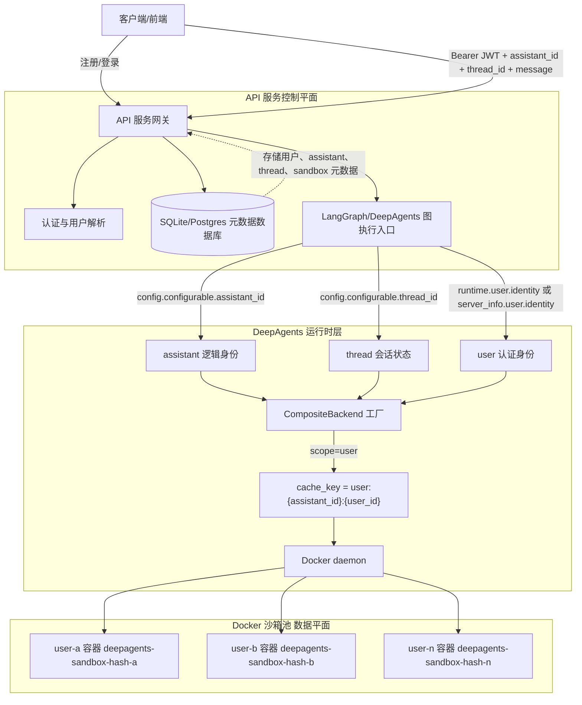
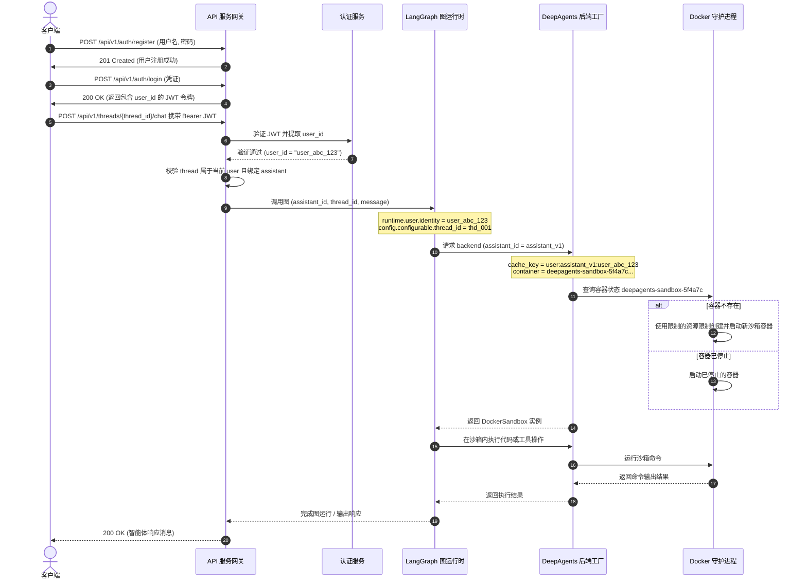
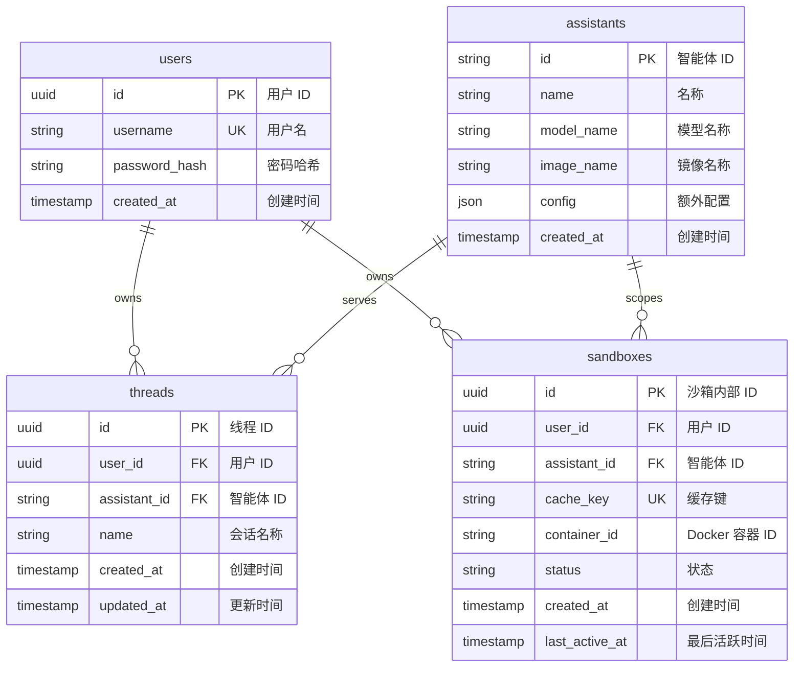
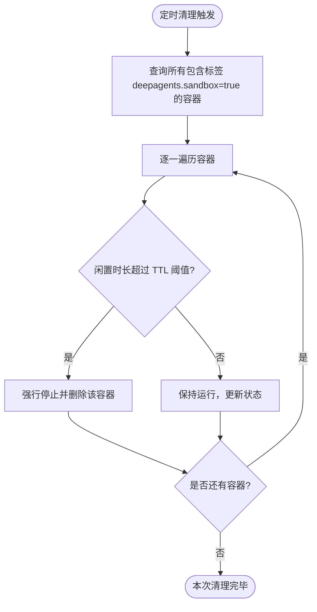
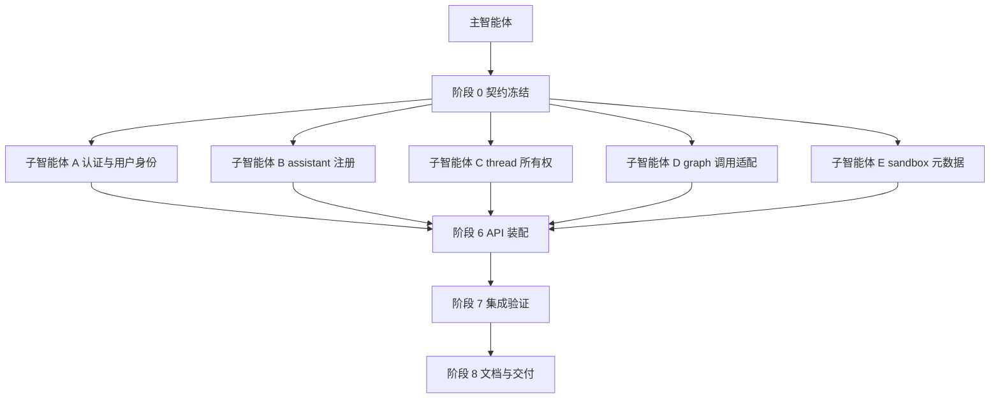

# 外部 API 服务设计：用户级 Docker 沙箱隔离管理

本文件定义了对外提供 API 服务的系统设计方案，该服务提供用户注册、智能体（Assistant）管理以及用户级 Docker 沙箱隔离。

核心隔离语义是：同一个 `assistant_id + user_id` 下的多个 `thread_id` 共享同一个持久化 Docker 沙箱；不同用户使用不同沙箱；不同 assistant 默认也不会共享用户沙箱。

---

## 1. 系统架构

该服务在 `deepagents` 运行时之上充当认证、编排与路由层，将外部 HTTP 请求映射到已认证的用户会话，调用相应的 LangGraph/DeepAgents 图，并确保所有工具执行或代码编译都在用户的私有持久化 Docker 容器内运行。

Deep Agents 本身不是固定形态的 Web 网关：`create_deep_agent()` 返回的是 LangGraph 图。对外 API 可以采用两种合理形态：

- **推荐形态**：API 网关负责用户、assistant、thread 元数据和业务路由，实际图执行交给 LangGraph/Agent Protocol 服务；通过 custom auth 注入 `runtime.user.identity`，通过 runnable config 注入 `assistant_id` 和 `thread_id`。
- **自托管形态**：FastAPI 服务直接持有并调用 DeepAgents 图；此时仍应复用 DeepAgents backend factory 和 `provider = "docker" + scope = "user"` 语义，不应在业务 handler 中重复实现一套容器生命周期。

### 架构拓扑图



### 合理性分析

该设计方向整体合理，但必须把 API 服务职责和 DeepAgents 运行时职责分开：

- `assistant` 是逻辑上的已部署图/配置对象，不是 Python 进程。沙箱 key 需要包含 `assistant_id`，否则两个 assistant 可能误共享同一个用户容器。
- `user` 是认证后的稳定调用者身份。`scope = "user"` 必须从 custom auth 注入的身份字段读取，不能从请求体里的 `user_id` 或前端可改字段读取。
- `thread` 是 LangGraph 会话状态标识，用于多轮对话和 checkpoint；在 `scope = "user"` 下它不参与沙箱 cache key。同一用户多个 thread 共享沙箱是预期行为。
- `@auth.on.threads` 或业务数据库的 thread owner 检查只解决“谁能访问哪个 thread”，不会自动改变 sandbox 复用粒度。
- API handler 可以管理用户注册、登录、assistant 注册、thread 创建和调用入口，但容器创建、复用、命名、资源限制应落在 DeepAgents Docker sandbox provider/backend factory 中，避免和 repo 已有 deploy 实现分叉。

### 核心组件说明

1. **FastAPI Web 框架**：暴露用于认证、智能体管理和会话路由的 REST 端点。
2. **元数据数据库 (SQLite 或 PostgreSQL)**：存储用户、会话线程、智能体配置以及活跃沙箱容器生命周期的持久化数据。
3. **JWT 身份认证**：验证外部客户端请求，提取 `user_id` 并将其注入到线程的执行上下文中。
4. **运行时身份注入**：通过 LangGraph custom auth 或自托管适配层提供 `runtime.user.identity` / `server_info.user.identity`，以便底层 DeepAgents 沙箱工厂解析出对应用户的缓存键。
5. **Docker 沙箱池**：管理实际的物理 Docker 容器。每个容器均配置了严格的资源上限，并隔离运行生成的代码或工具指令。

---

## 2. 请求与执行流

当用户注册、启动智能体并发送带有特定 `thread_id` 的聊天请求时，系统处理流程如下：



---

## 3. 数据库结构设计

服务维护一个关系型数据库，以记录系统元数据、会话线程所有权和沙箱状态。



### 数据表定义 (DDL)

```sql
-- 用户表
CREATE TABLE users (
    id UUID PRIMARY KEY DEFAULT gen_random_uuid(),
    username VARCHAR(100) UNIQUE NOT NULL,
    password_hash VARCHAR(255) NOT NULL,
    created_at TIMESTAMP DEFAULT CURRENT_TIMESTAMP
);

-- 智能体表
CREATE TABLE assistants (
    id VARCHAR(100) PRIMARY KEY,
    name VARCHAR(255) NOT NULL,
    model_name VARCHAR(100) NOT NULL,
    image_name VARCHAR(255) DEFAULT 'python:3.12-slim',
    config JSONB DEFAULT '{}'::jsonb,
    created_at TIMESTAMP DEFAULT CURRENT_TIMESTAMP
);

-- 会话线程表
CREATE TABLE threads (
    id UUID PRIMARY KEY DEFAULT gen_random_uuid(),
    user_id UUID NOT NULL REFERENCES users(id) ON DELETE CASCADE,
    assistant_id VARCHAR(100) NOT NULL REFERENCES assistants(id) ON DELETE CASCADE,
    name VARCHAR(255) DEFAULT 'New Conversation',
    created_at TIMESTAMP DEFAULT CURRENT_TIMESTAMP,
    updated_at TIMESTAMP DEFAULT CURRENT_TIMESTAMP
);

-- 沙箱容器关系表
CREATE TABLE sandboxes (
    id UUID PRIMARY KEY DEFAULT gen_random_uuid(),
    user_id UUID NOT NULL REFERENCES users(id) ON DELETE CASCADE,
    assistant_id VARCHAR(100) NOT NULL REFERENCES assistants(id) ON DELETE CASCADE,
    cache_key VARCHAR(255) UNIQUE NOT NULL,
    container_id VARCHAR(100) NOT NULL,
    status VARCHAR(50) DEFAULT 'running',
    created_at TIMESTAMP DEFAULT CURRENT_TIMESTAMP,
    last_active_at TIMESTAMP DEFAULT CURRENT_TIMESTAMP,
    UNIQUE (user_id, assistant_id)
);

CREATE INDEX idx_threads_user ON threads(user_id);
CREATE INDEX idx_sandboxes_user_assistant ON sandboxes(user_id, assistant_id);
CREATE INDEX idx_sandboxes_key ON sandboxes(cache_key);
```

---

## 4. API 接口规范

### 1. 认证与用户管理

| 请求方法 | 路由端点 | 描述 | 请求体 | 响应体 |
| :--- | :--- | :--- | :--- | :--- |
| `POST` | `/api/v1/auth/register` | 注册新用户 | `{ "username": "...", "password": "..." }` | `{ "id": "...", "username": "..." }` |
| `POST` | `/api/v1/auth/login` | 登录并获取 JWT 令牌 | `{ "username": "...", "password": "..." }` | `{ "access_token": "...", "token_type": "bearer" }` |

### 2. 智能体管理

| 请求方法 | 路由端点 | 描述 | 请求体 | 响应体 |
| :--- | :--- | :--- | :--- | :--- |
| `POST` | `/api/v1/assistants` | 注册并启动智能体定义 | `{ "id": "...", "name": "...", "model": "...", "image": "..." }` | `{ "id": "...", "status": "active" }` |
| `GET` | `/api/v1/assistants` | 获取所有注册的智能体列表 | 无 | `[ { "id": "...", "name": "..." } ]` |

### 3. 会话线程管理 (限定 JWT 认证的用户本人)

| 请求方法 | 路由端点 | 描述 | 请求体 | 响应体 |
| :--- | :--- | :--- | :--- | :--- |
| `POST` | `/api/v1/threads` | 创建新的对话线程 | `{ "assistant_id": "...", "name": "..." }` | `{ "thread_id": "...", "user_id": "..." }` |
| `GET` | `/api/v1/threads` | 列出当前用户拥有的所有线程 | 无 | `[ { "thread_id": "...", "assistant_id": "..." } ]` |
| `POST` | `/api/v1/threads/{thread_id}/chat` | 发送对话并获取执行响应 | `{ "message": "..." }` | `{ "response": "...", "thread_id": "..." }` |

---

## 5. 核心代码实现蓝图

API 服务实现时应保持一条边界：业务 API 负责鉴权、元数据和调用路由；DeepAgents/LangGraph 图负责 agent 执行；Docker sandbox provider 负责容器创建、复用和安全参数。

不建议在 `/chat` handler 里手工调用 Docker SDK 创建容器，因为这会绕过当前 repo 已有的 `_build_backend_factory()`、`scope = "user"`、`CompositeBackend`、skill 同步和 user memory namespace 逻辑。

推荐的 handler 结构如下：

```python
"""API gateway outline for user-scoped DeepAgents execution."""

from __future__ import annotations

from typing import Annotated, Any

from fastapi import Depends, FastAPI, HTTPException, status
from pydantic import BaseModel, Field

app = FastAPI(title="DeepAgents 用户隔离沙箱 API 服务")


class AssistantCreate(BaseModel):
    id: str = Field(..., pattern=r"^[a-zA-Z0-9_-]+$")
    name: str
    model: str
    image: str = "python:3.12-slim"
    config: dict[str, Any] = Field(default_factory=dict)


class ThreadCreate(BaseModel):
    assistant_id: str
    name: str | None = None


class ChatRequest(BaseModel):
    message: str


class ChatResponse(BaseModel):
    response: str
    thread_id: str
    assistant_id: str


async def get_current_user_id() -> str:
    """Return the stable authenticated user identity."""
    raise NotImplementedError


async def load_thread_for_user(thread_id: str, user_id: str) -> dict[str, Any]:
    """Load a thread row after enforcing user ownership."""
    raise NotImplementedError


async def invoke_deepagents_graph(
    *,
    assistant_id: str,
    thread_id: str,
    user_id: str,
    message: str,
) -> str:
    """Invoke the LangGraph/DeepAgents runtime.

    In a LangGraph deployment, the Bearer token should be forwarded so custom
    auth populates `runtime.user.identity`. In a direct self-hosted runtime,
    the adapter must provide the same server runtime identity shape.
    """
    config = {
        "configurable": {
            "assistant_id": assistant_id,
            "thread_id": thread_id,
        },
    }
    input_state = {"messages": [{"role": "user", "content": message}]}

    # Pseudocode:
    # result = await graph.ainvoke(input_state, config=config)
    # The graph's backend factory derives:
    #   cache_key = f"user:{assistant_id}:{user_id}"
    # from the authenticated runtime identity, not from this handler.
    raise NotImplementedError(f"invoke graph with {input_state=} {config=} {user_id=}")


@app.post("/api/v1/threads/{thread_id}/chat", response_model=ChatResponse)
async def chat_with_assistant(
    thread_id: str,
    payload: ChatRequest,
    user_id: Annotated[str, Depends(get_current_user_id)],
) -> ChatResponse:
    """Route one authenticated user message to the bound assistant/thread."""
    thread = await load_thread_for_user(thread_id, user_id)
    assistant_id = str(thread["assistant_id"])

    response = await invoke_deepagents_graph(
        assistant_id=assistant_id,
        thread_id=thread_id,
        user_id=user_id,
        message=payload.message,
    )
    return ChatResponse(
        response=response,
        thread_id=thread_id,
        assistant_id=assistant_id,
    )
```

关键实现要求：

- 创建 thread 时记录 `thread_id -> user_id + assistant_id`，chat 前必须先做 owner 校验。
- 调用图时传入 `config.configurable.thread_id`，否则 LangGraph 无法稳定关联会话状态。
- 调用图时传入或解析 `assistant_id`，否则不同 assistant 的用户沙箱可能被错误合并。
- 用户身份必须来自服务端认证结果，并进入 LangGraph runtime/custom auth；不要信任请求体中的 `user_id`。
- Docker 容器生命周期由 `provider = "docker" + scope = "user"` 的 backend factory 管理，业务 API 只保存必要的审计/展示元数据。

---

## 6. 容器生命周期管理与安全加固

### 容器安全参数设计
为了确保各个用户的 Docker 容器充当坚固的边界，在沙箱工厂中启动物理容器时，必须强制附加以下低特权约束配置：

```python
{
    "mem_limit": "1g",                    # 限制单个用户的最大内存占用，防范内存耗尽攻击
    "pids_limit": 256,                    # 限制最大进程/线程数，阻断 Fork 炸弹攻击
    "network_disabled": True,             # 彻底禁用容器外网，切断数据泄露与内网渗透途径
    "cap_drop": ["ALL"],                  # 剥离所有 Linux 特权能力，阻止 root 权限逃逸
    "security_opt": ["no-new-privileges"],# 强制子进程无法通过 setuid/setgid 机制提升特权
    "read_only": False,                   # 保持 /workspace 可写，保障代码正常运行
}
```

> [!WARNING]
> 绝对不要将宿主机的 `/var/run/docker.sock` 挂载进用户的隔离容器中。否则，容器内的程序将获得对宿主机的完整控制权限，使用户隔离失效。

### 自动闲置清理守护服务 (Reaper Service)
当注册用户或分配的会话沙箱数量较多时，闲置的容器将导致系统文件描述符和内存慢慢耗竭。必须定期在后台运行一个自动清理线程：



#### 闲置清理实现片段
```python
def reap_idle_containers(max_idle_seconds: int = 3600):
    """停止并销毁超过设定 TTL 时间未被调用的用户闲置沙箱容器。"""
    client = docker.from_env()
    now = datetime.datetime.now(datetime.timezone.utc)
    
    containers = client.containers.list(
        all=True,
        filters={"label": "deepagents.sandbox=true"}
    )
    
    for container in containers:
        cache_key = container.labels.get("deepagents.cache_key")
        record = SANDBOXES_DB.get(cache_key)
        if record:
            last_active = record["last_active"]
            idle_duration = (now - last_active).total_seconds()
            
            if idle_duration > max_idle_seconds:
                print(f"正在清理闲置容器 {container.name} (已闲置 {idle_duration} 秒)...")
                try:
                    container.stop(timeout=5)
                    container.remove(force=True)
                    SANDBOXES_DB.pop(cache_key, None)
                except Exception as e:
                    print(f"清理容器 {container.name} 失败: {e}")
```

---

## 7. 交互式控制台设计概念

为了给系统管理员与最终用户提供一流的使用体验，本平台额外定义了一个**可视化控制台仪表盘**的设计概念，用于实时观察活跃沙箱利用率并进行会话演练。

### 管理仪表盘布局示意图 (Glassmorphism 磨砂玻璃风格)

```text
+------------------------------------------------------------------------------------------------+
|  DEEPAGENTS   [数据大屏]  [智能体管理]  [沙箱状态监测]  [审计日志]         (当前登录: Alice)  |
+------------------------------------------------------------------------------------------------+
|  活跃用户沙箱概览                                                              [+ 创建新实例]   |
|                                                                                                |
|  +---------------------------+  +---------------------------+  +----------------------------+  |
|  | 用户沙箱: usr_alice_982    |  | 用户沙箱: usr_bob_472      |  | 用户沙箱: usr_charlie_119   |  |
|  | 容器: active-python-slim  |  | 容器: active-python-slim  |  | 容器: idle-python-slim     |  |
|  | 占用: CPU 1.2%   RAM 142MB|  | 占用: CPU 0.1%   RAM 98MB |  | 占用: CPU 0.0%   RAM 45MB   |  |
|  | 状态: [ 正在运行 ]         |  | 状态: [ 正在运行 ]         |  | 状态: [ 闲置 - TTL 剩12分 ]|  |
|  | [文件终端] [重启沙箱] [销毁] |  | [文件终端] [重启沙箱] [销毁] |  | [文件终端] [重启沙箱] [销毁] |  |
|  +---------------------------+  +---------------------------+  +----------------------------+  |
|                                                                                                |
|  会话实时演练                                                                                  |
|  +------------------------------------------------------------------------------------------+  |
|  | 会话 ID: thd_8192a7      | 智能体: 编程辅助助手         | 指向沙箱: usr_alice_982      |  |
|  |------------------------------------------------------------------------------------------|  |
|  |  用户: 帮我运行 python 代码，在 '/workspace/hello.txt' 中写入 "Hi Docker"。              |  |
|  |  系统: 正在挂载并调取专属沙箱 'deepagents-sandbox-a8f27...'。                             |  |
|  |        在隔离环境 Python 3.12 内执行代码成功... 文件写入完毕！                           |  |
|  |                                                                                          |  |
|  |  [ 输入你的测试命令或对话...                                                ] [ 发送 ]   |  |
|  +------------------------------------------------------------------------------------------+  |
+------------------------------------------------------------------------------------------------+
```

### 控制台三大亮点

- **实时红绿健康状态灯**：基于容器使用状态实时绘制彩色的健康度徽章（绿色代表活跃处理中，橙色代表进入闲置倒计时，灰色代表已休眠挂起）。
- **内置网页虚拟终端**：允许通过 WebSocket 将容器工作区 `/workspace` 实时以 Bash 终端形式挂载在前端，方便开发人员直接查看生成的文件状态。
- **线程追踪器**：用户可在左侧切换同一 assistant 下的不同 `thread_id` 会话，后台编排层会确保这些 thread 指向同一个用户沙箱，既保障文件持久化，又划清多租户隐私边界。

---

## 8. 主智能体调度与子智能体阶段拆解

本节把前面的 API 服务设计拆成可以由多个子智能体分别开发的阶段。这里的“一个窗口”按“一个子智能体在单个会话上下文内完成一个模块”的含义约束：每个子智能体只拿到必要背景、固定文件边界、明确验收命令和交付格式，不承担跨模块集成职责。

### 拆解原则

- 一个子智能体只负责一个模块或一个窄切面，避免同时修改 API、数据库、运行时和 Docker 生命周期。
- 每个阶段必须有稳定输入、固定写入范围、可本地验证的完成条件。
- 跨模块契约由主智能体冻结并维护，子智能体不得擅自修改公共 DTO、数据库字段和 graph invocation 协议。
- 依赖顺序由主智能体控制：契约冻结后可并行开发独立模块，最后由主智能体或集成子智能体合并。
- 子智能体连续自修复失败 3 次时必须返回 `blocked`，交给主智能体缩小范围或重写任务。

### 主智能体职责

主智能体不是具体模块开发者，而是调度者和集成者：

1. 冻结 `assistant_id`、`user_id`、`thread_id`、`cache_key`、路由和数据库字段契约。
2. 给每个子智能体分发只包含相关背景的任务包。
3. 维护文件所有权，避免两个子智能体同时修改同一个实现文件。
4. 审查每个子智能体的交付物，执行阶段验收命令。
5. 合并模块后运行端到端测试，确认同用户多 thread 共享沙箱、不同用户隔离。
6. 统一更新文档、示例配置和风险说明。

### 调度拓扑图



### 阶段 0：契约冻结

执行者：主智能体。

目标：在任何子智能体写代码之前冻结跨模块契约。

输入：

- 本设计文档。
- `docs/docker-user-scope-sandbox.md`。
- `docs/user-scope-docker-sandbox-design.md`。
- 当前 DeepAgents deploy 模板中 `scope = "user"` 的 cache key 语义。

输出：

- 路由契约：`POST /api/v1/threads/{thread_id}/chat` 必须先做 thread owner 校验。
- 身份契约：`user_id` 只来自认证结果，不来自请求体。
- 运行时契约：调用图时必须传入 `config.configurable.assistant_id` 和 `config.configurable.thread_id`。
- 沙箱契约：用户级 Docker 沙箱 key 固定为 `user:{assistant_id}:{user_id}`。
- 数据契约：`threads` 保存 `user_id + assistant_id`，`sandboxes` 保存 `user_id + assistant_id + cache_key + container_id`。

验收：

- 主智能体产出阶段任务包。
- 每个任务包都有写入范围、禁止修改范围、测试命令和交接格式。

### 阶段 1：认证与用户身份模块

子智能体：`api-auth-agent`。

目标：实现或补齐用户注册、登录、JWT 校验，以及服务端稳定 `user_id` 提取。

建议写入范围：

- `examples/deploy-docker-user-sandbox/auth.py`
- `examples/deploy-docker-user-sandbox/models.py` 中的用户相关 DTO
- `examples/deploy-docker-user-sandbox/tests/test_auth.py`

禁止修改：

- graph 调用适配。
- Docker sandbox provider。
- thread 业务逻辑。

输入契约：

- JWT 的 `sub` 是稳定 `user_id`。
- `get_current_user_id()` 返回字符串身份。

输出契约：

- `get_current_user_id()` 可作为 FastAPI dependency 使用。
- 注册和登录接口不暴露密码哈希。
- 认证失败返回 401，凭证错误不泄露用户是否存在。

验收：

- 注册成功。
- 重复用户名失败。
- 登录成功返回 bearer token。
- 无 token、坏 token、过期 token 都被拒绝。

### 阶段 2：assistant 注册与配置模块

子智能体：`assistant-registry-agent`。

目标：实现 assistant 元数据注册、查询和配置解析。这里的 assistant 是逻辑图/配置身份，不是 Python 进程。

建议写入范围：

- `examples/deploy-docker-user-sandbox/assistants.py`
- `examples/deploy-docker-user-sandbox/models.py` 中的 assistant DTO
- `examples/deploy-docker-user-sandbox/tests/test_assistants.py`

禁止修改：

- 用户认证实现。
- thread owner 校验。
- Docker 容器生命周期。

输入契约：

- `assistant_id` 是外部 API 和 graph config 共用的逻辑身份。
- assistant 配置至少包含 `id`、`name`、`model`、`image`、`base_dir`。

输出契约：

- 可创建 assistant。
- 可查询 assistant。
- 重复 `assistant_id` 明确失败。
- `assistant_id` 只允许安全字符，不能被用作路径拼接或容器名原文。

验收：

- assistant 创建和查询测试通过。
- 无效 `assistant_id` 被拒绝。
- 未来新增字段不破坏已有响应字段。

### 阶段 3：thread 所有权与会话模块

子智能体：`thread-service-agent`。

目标：实现 thread 创建、列表、归属校验和 assistant 绑定。

建议写入范围：

- `examples/deploy-docker-user-sandbox/threads.py`
- `examples/deploy-docker-user-sandbox/models.py` 中的 thread DTO
- `examples/deploy-docker-user-sandbox/tests/test_threads.py`

禁止修改：

- 认证 token 格式。
- graph invocation 细节。
- Docker sandbox key 生成。

输入契约：

- 创建 thread 时必须有当前 `user_id` 和合法 `assistant_id`。
- chat 前必须通过 `load_thread_for_user(thread_id, user_id)` 做归属校验。

输出契约：

- `thread_id` 绑定唯一 `user_id + assistant_id`。
- 用户只能列出自己的 thread。
- 用户不能访问其他用户的 thread。

验收：

- 同用户可读取自己的 thread。
- 不同用户访问同一 thread 返回 403 或 404，具体策略由阶段 0 冻结。
- 不存在的 assistant 不能创建 thread。

### 阶段 4：DeepAgents graph 调用适配模块

子智能体：`graph-runtime-agent`。

目标：实现 API 服务到 LangGraph/DeepAgents 图的调用适配，保证身份和配置进入正确位置。

建议写入范围：

- `examples/deploy-docker-user-sandbox/graph_runtime.py`
- `examples/deploy-docker-user-sandbox/tests/test_graph_runtime.py`

禁止修改：

- 用户注册登录。
- thread 存储。
- Docker provider 内部实现。

输入契约：

- 参数为 `assistant_id`、`thread_id`、`user_id`、`message`。
- `assistant_id` 和 `thread_id` 必须进入 runnable config。
- `user_id` 必须进入 LangGraph custom auth/runtime identity，而不是由模型输入推断。

输出契约：

- `invoke_deepagents_graph()` 返回最终 assistant 响应文本或结构化消息。
- 调用失败时保留可诊断错误，不吞掉 backend factory 的 `user identity is required when sandbox scope is 'user'`。
- 不在该模块内手工创建 Docker 容器。

验收：

- 单元测试断言调用配置包含 `configurable.assistant_id` 和 `configurable.thread_id`。
- 单元测试断言 graph runtime 能获得认证用户身份。
- 缺少 user identity 时失败清晰。

### 阶段 5：sandbox 元数据与清理模块

子智能体：`sandbox-metadata-agent`。

目标：记录和清理用户级 sandbox 元数据，但不替代 DeepAgents Docker backend factory。

建议写入范围：

- `examples/deploy-docker-user-sandbox/sandboxes.py`
- `examples/deploy-docker-user-sandbox/reaper.py`
- `examples/deploy-docker-user-sandbox/tests/test_sandboxes.py`

禁止修改：

- `_build_backend_factory()` 的 cache key 语义。
- Docker provider 的容器创建逻辑。
- graph invocation adapter。

输入契约：

- sandbox metadata 以 `cache_key = user:{assistant_id}:{user_id}` 为唯一业务键。
- 容器名使用 hash，不直接使用原始 `user_id`。

输出契约：

- 可 upsert sandbox 元数据。
- 可按 `user_id + assistant_id` 查询 sandbox 状态。
- reaper 只处理带 `deepagents.sandbox=true` label 的容器。

验收：

- 同一 `user_id + assistant_id` 只产生一条 sandbox 记录。
- 不同用户同一 assistant 产生不同记录。
- reaper 不会处理没有 DeepAgents label 的容器。

### 阶段 6：API 装配模块

子智能体：`api-composition-agent`。

目标：把认证、assistant、thread、graph runtime、sandbox metadata 组合成 FastAPI 服务。

建议写入范围：

- `examples/deploy-docker-user-sandbox/server.py`
- `examples/deploy-docker-user-sandbox/tests/test_api_routes.py`

禁止修改：

- 阶段 1 到阶段 5 的内部实现，除非主智能体明确授权。
- DeepAgents deploy 模板。

输入契约：

- 阶段 1 到阶段 5 的 public functions 已冻结。
- `chat_with_assistant()` 的主路径是：认证用户 -> 加载 thread -> 调用 graph -> 返回响应。

输出契约：

- REST route 全部挂载。
- chat route 不接受请求体 `user_id`。
- chat route 不手工创建 Docker 容器。

验收：

- API route 测试通过。
- 未登录请求被拒绝。
- 用户访问他人 thread 被拒绝。
- 合法 chat 调用向 graph adapter 传递正确 `assistant_id`、`thread_id`、`user_id`。

### 阶段 7：集成验证模块

子智能体：`integration-validation-agent`。

目标：验证完整用户级沙箱语义，不负责新增业务功能。

建议写入范围：

- `examples/deploy-docker-user-sandbox/tests/test_user_scope_flow.py`
- 必要的测试 fixture 或 README 中的测试说明。

禁止修改：

- 功能实现文件，除非只是修复测试暴露的小范围接线问题并经主智能体确认。

测试场景：

1. 用户 A 创建 assistant 和 thread 1，写入 `/workspace/user.txt`。
2. 用户 A 创建 thread 2，读取同一个文件，应成功。
3. 用户 B 创建 thread 1，读取同一路径，应不存在。
4. 用户 A 再次读取，应仍成功。
5. 缺少 user identity 时，graph invocation 或 backend factory 明确失败。

验收：

- 单元测试覆盖 API ownership。
- 集成测试覆盖同用户多 thread 共享沙箱。
- 集成测试覆盖不同用户隔离。
- Docker 相关测试在无 Docker 环境时应明确 skip，而不是误报成功。

### 阶段 8：文档与运维交付

子智能体：`docs-runbook-agent`。

目标：把开发结果转成用户可运行、运维可诊断的交付材料。

建议写入范围：

- `examples/deploy-docker-user-sandbox/README.md`
- `docs/docker-user-scope-sandbox.md`
- 本设计文档的实现状态段落。

禁止修改：

- 业务实现。
- 测试断言。

输出契约：

- 给出本地启动命令。
- 给出 `DOCKER_HOST=ssh://...` 的远程 Docker 运行说明。
- 明确 `provider = "docker" + scope = "user"` 需要认证身份。
- 明确 `provider = "none"` 不是安全沙箱。

验收：

- README 中的命令能被复制执行。
- 文档能解释 `assistant`、`user`、`thread` 和 Docker 容器之间的映射。
- 文档说明如何验证容器 label 和清理残留容器。

### 子智能体任务包模板

主智能体给每个子智能体的任务包应固定为以下结构：

```text
目标：
  <本阶段要完成的模块结果>

背景：
  - assistant 是逻辑图身份，不是进程
  - user 来自认证身份
  - thread 是会话状态
  - sandbox cache key = user:{assistant_id}:{user_id}

允许修改：
  - <文件列表>

禁止修改：
  - <文件列表或模块>

必须保持的契约：
  - <函数签名、DTO、数据库字段、错误文案>

验收命令：
  - <pytest 或其他命令>

交付格式：
  - 修改文件列表
  - 已通过测试
  - 未覆盖风险
  - 需要主智能体处理的集成点
```

### 主智能体集成门禁

主智能体只有在以下条件满足后才能进入最终合并：

- 所有阶段都明确返回 `done` 或 `blocked`，没有悬空任务。
- 没有两个子智能体修改同一文件的同一区域。
- `assistant_id + user_id -> sandbox`、`thread_id -> conversation state` 的边界没有被改写。
- API route 没有把请求体中的 `user_id` 当作可信身份。
- Docker 容器创建仍由 DeepAgents Docker backend/provider 负责。
- 最终验证覆盖同用户多 thread 共享、不同用户隔离、缺少身份失败。
